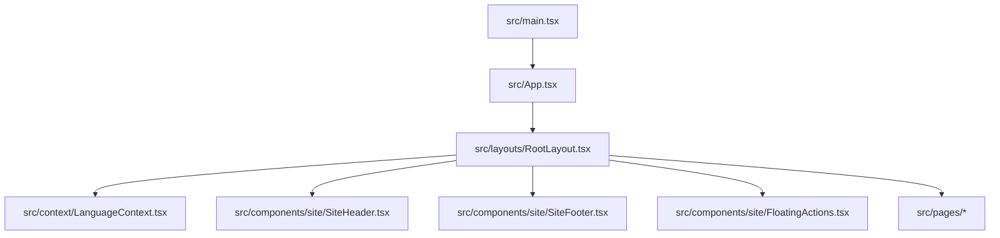

# Uday Foundation Trust — Project Brain (BRAIN.md)

Welcome! This document serves as the absolute single source of truth for the **Uday Foundation Trust** web application (`uday-spark-forge`). It contains fully reverse-engineered documentation of the project's structure, architecture, page routes, styling configuration, localization engines, states, data schemas, and key design patterns.

---

## 1. System Architecture & Directory Map

The project is built on **React 19**, **Vite**, **TypeScript**, and **Tailwind CSS v4**. Below is the logical structural outline of the codebase:



### Key Folders & Files
* **[src/main.tsx](file:///d:/Project/NGO-2/uday-spark-forge/src/main.tsx)**: Mounts the main React application shell wrapped in `React.StrictMode`.
* **[src/App.tsx](file:///d:/Project/NGO-2/uday-spark-forge/src/App.tsx)**: Core React Router setup utilizing `lazy` page imports and suspense loader states. Defines all available inner pages.
* **[src/layouts/](file:///d:/Project/NGO-2/uday-spark-forge/src/layouts)**: Contains [RootLayout.tsx](file:///d:/Project/NGO-2/uday-spark-forge/src/layouts/RootLayout.tsx), which embeds the header, footer, floating elements, global state wrappers, and routing outlets.
* **[src/components/site/](file:///d:/Project/NGO-2/uday-spark-forge/src/components/site)**: Contains reusable presentational components:
  * [PageHero.tsx](file:///d:/Project/NGO-2/uday-spark-forge/src/components/site/PageHero.tsx): The unified header hero component used across all sub-pages for visual alignment.
  * [Counter.tsx](file:///d:/Project/NGO-2/uday-spark-forge/src/components/site/Counter.tsx): High-performance number counter animated dynamically using `IntersectionObserver`.
  * [FloatingActions.tsx](file:///d:/Project/NGO-2/uday-spark-forge/src/components/site/FloatingActions.tsx): Handles back-to-top buttons, floating WhatsApp channel anchors, and instant Donate buttons.
  * [SiteHeader.tsx](file:///d:/Project/NGO-2/uday-spark-forge/src/components/site/SiteHeader.tsx): The primary global header navigation bar, containing language toggle controls.
  * [SiteFooter.tsx](file:///d:/Project/NGO-2/uday-spark-forge/src/components/site/SiteFooter.tsx): The main organization footer containing site links, addresses, tax registry badges, and maps.
* **[src/pages/](file:///d:/Project/NGO-2/uday-spark-forge/src/pages)**: Folder holding all routing views.
* **[src/constants/site.ts](file:///d:/Project/NGO-2/uday-spark-forge/src/constants/site.ts)**: Central site configurations (emails, phone numbers, tax registry keys, static socials, and links).
* **[src/context/LanguageContext.tsx](file:///d:/Project/NGO-2/uday-spark-forge/src/context/LanguageContext.tsx)**: Central React Context provider defining localization dictionaries for English (`en`), Gujarati (`gu`), and Hindi (`hi`).
* **[src/styles/index.css](file:///d:/Project/NGO-2/uday-spark-forge/src/styles/index.css)**: Central styling sheet using Tailwind CSS v4 variables, typography (Noto fonts, Fraunces), transitions, and glassmorphism.

---

## 2. Localization System (`LanguageContext`)

Internationalization is implemented cleanly using React Context in [LanguageContext.tsx](file:///d:/Project/NGO-2/uday-spark-forge/src/context/LanguageContext.tsx). 

* **State**: Current active language (`language` - "en" | "gu" | "hi").
* **Functions**:
  * `setLanguage(lang)`: Updates state and sets a `"lang"` item in `localStorage` for cross-session persistence.
  * `t(key)`: Translates key strings. Nested dot paths are queried dynamically (e.g. `t("nav.home")`).
* **Fallback**: Defaults to English (`en`) if a translation path is missing.
* **Impact of Modifications**: Changing standard key structures in `LanguageContext.tsx` without corresponding updates in pages will cause layout strings to disappear or render empty values.

---

## 3. Page Routes & Sub-Page Descriptions

### 1. Home Page (`Home.tsx`)
* **Purpose**: Serves as the landing page of the NGO website.
* **Hero Section**: Handcrafted, landing-page-specific slider with full-bleed layout, call-to-actions, and main mission titles. Kept distinct from sub-page standard heroes.
* **Components**: Feature statistics, core messages from the founders, quick programs grids, and direct access points to donations.

### 2. About Page (`About.tsx`)
* **Purpose**: Detailed look at the history, mission, vision, values, and official legal registries of Uday Foundation Trust.
* **Hero**: Standardised [PageHero](file:///d:/Project/NGO-2/uday-spark-forge/src/components/site/PageHero.tsx) utilising `hero-children.jpg` background image.
* **Key Features**: Visual vertical journey timeline, founders' profiles, and core organization statements.

### 3. Programs Page (`Programs.tsx`)
* **Purpose**: Outlines the eight key intervention domains of the NGO.
* **Hero**: Standardised `PageHero` with `program-education.jpg`.
* **Details**: Dynamic smooth scrolling targets (`scrollToDetail`) directing users directly down to detail sheets describing each program (Education, Health, Environment, Disaster Relief, etc.) and impact metrics.

### 4. Projects Page (`Projects.tsx`)
* **Purpose**: Spotlights completed and ongoing field projects in rural Sanand.
* **Hero**: Standardised `PageHero` with `program-trees.jpg`.
* **State**: Filters projects dynamically by category (All, Ongoing, Completed, Education, Environment, etc.) using client-side react state. Includes dynamic statistics counter cards.

### 5. Events Page (`Events.tsx`)
* **Purpose**: Event announcements, camp schedules, and post-event summaries.
* **Hero**: Standardised `PageHero` with `program-health.jpg`.
* **Copy**: Renders medical camp outlines, upcoming event schedules, and sports drives.

### 6. Gallery Page (`Gallery.tsx`)
* **Purpose**: Grid-based media library showcasing direct work in the field.
* **Hero**: Standardised `PageHero` with `hero-children.jpg`.
* **State**: Custom category filter states and modal lightboxes for enlarged previews.

### 7. Team Page (`Team.tsx`)
* **Purpose**: Introduces trustees, core team members, and the president.
* **Hero**: Standardised `PageHero` pointing to an leadership-focused Unsplash background.
* **Special Area**: Interactive President's Spotlight detailing the visionary quotes of Gulabbhai Khodabhai Bauddh.

### 8. Get Involved Page (`GetInvolved.tsx`)
* **Purpose**: Landing point for volunteers, corporate sponsors, and CSR collaborations.
* **Hero Section**: Customized responsive hero banner showing breadcrumbs, shape-the-future tags, and action buttons.
* **Interactive Elements**: Core statistic arrays, ways-to-help grids (displaying **"Apply Now"** action items), structured horizontal journeys, and client-form modals.

### 9. Donate Page (`Donate.tsx`)
* **Purpose**: Secure donation gateway portal.
* **Hero**: Standardised `PageHero` showing charity hands.
* **State**: Pre-selected donation level chips and custom number inputs. Offers tax benefit disclaimers.

### 10. Contact Page (`Contact.tsx`)
* **Purpose**: Reachable communication channels.
* **Hero**: Standardised `PageHero` with support imagery.
* **Elements**: Active maps, phone triggers, email, and social networks.

### 11. Transparency Page (`Transparency.tsx`)
* **Purpose**: Open registry verification for trust integrity.
* **Hero**: Standardised `PageHero` with compliance imagery.
* **Cards Layout**: Features rearranged top-left clickable document icons (`FileText` in standout primary blue wrappers) which open respective PDF certificates (e.g. `/Uday_Foundation_Trust_Registration.pdf` or `/Uday_Foundation_F_Registration.pdf`) in a new tab. Verified check marks are positioned at the top-right of each compliance block.

---

## 4. Get Involved Registration Form Logic & State Map

The Registration form in [GetInvolved.tsx](file:///d:/Project/NGO-2/uday-spark-forge/src/pages/GetInvolved.tsx) is a fully stateful React Modal Component.

### State Variable Mapping
1. `isModalOpen` (boolean): Controls display animation triggers.
2. `formName` (string): Full name input.
3. `formEmail` (string): Email identifier.
4. `formPhone` (string): Mobile/telephone number.
5. `formEducation` (string): Manually typed text indicating academic background.
6. `formAddress` (string): User's residential address and pincode.
7. `formSelfie` (File | null): Selected profile/portrait image.
8. `formIdDoc` (File | null): Selected identification document (Aadhaar Card / PAN Card).
9. `formResetKey` (number): Dynamic key state changed on successful submit to force-clear uncontrolled file input fields.
10. `formMessage` (string): Custom messages or availability logs (optional).

### Validation and Upload Details
* **Required Triggers**: Submitting triggers standard HTML5 field constraints. Custom program checks verify files exist in state variables.
* **Allowed Extensions**: Accepts `.jpg`, `.jpeg`, `.png`, and `.pdf` files.
* **Selfie Preview**: Generates temporary URLs using `URL.createObjectURL(formSelfie)` for instantaneous user preview if an image type file is uploaded.
* **UX Styling**: Custom dashed borders for document uploads, inline circular image frame preview for selfies, and scroll bars enabled via `max-h-[90vh] overflow-y-auto` styles inside the modal.

---

## 5. Design Tokens (Tailwind v4 Variables)

The design system is managed within [src/styles/index.css](file:///d:/Project/NGO-2/uday-spark-forge/src/styles/index.css#L48-L88). Modifying these variables will reflect theme modifications site-wide:

* **Primary Colors (Logo Blue)**: `var(--primary)` / `oklch(0.34 0.16 264)`
* **Secondary Colors (Bright Yellow)**: `var(--secondary)` / `oklch(0.86 0.17 92)`
* **Saffron Colors**: `var(--saffron)` / `oklch(0.74 0.17 55)`
* **Leaf/Green Colors**: `var(--leaf)` / `oklch(0.62 0.16 145)`
* **Surfaces & Cards**: `var(--surface)` / `oklch(1 0 0)`
* **Backgrounds**: `var(--background)` / `oklch(0.985 0.008 85)`

---

## 6. Developer Guidelines & Verification Commands

To guarantee stability, run these terminal operations inside the root directory `d:\Project\NGO-2\uday-spark-forge`:

```bash
# 1. Start development server
npm run dev

# 2. Check TypeScript type-safety (Run before staging any code)
npx tsc --noEmit

# 3. Compile client environment for production
npm run build
```

> [!WARNING]
> Keep `PageHero` modular. Do not hardcode inline styling in sub-page banner areas; always implement changes in `PageHero.tsx` or reference variables defined in the styling sheet.
